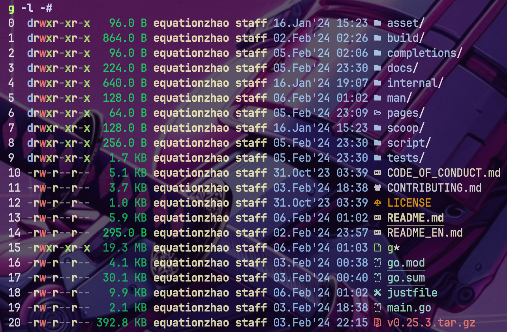

# default option

set default option in your config file, which can be found by `--help` option

<figure><figcaption></figcaption></figure>

```yaml
Args:
    - icon
    - time
    - owner
    - size
    - #
```

`g` will load the config and add these options to os.Args

use `--no-config` to ignore the config


using `--no-confg` in the configuration will also **ignore** the config

